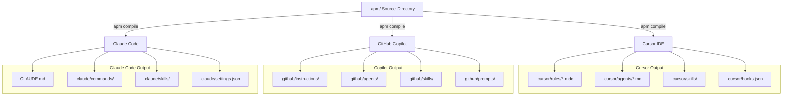

# Write Once, Agent Everywhere: Distributing AI Engineering Tooling Across IDEs and Teams

Your team's best developer practices are locked inside individual conversations. One engineer has a Cursor rule for code reviews. Another has a GitHub Copilot instruction for commit messages. A third has a custom prompt for architecture decisions. None of them share the same standards, and every new team member starts from scratch.

This is the distribution problem: how do you package engineering knowledge -- agent behaviors, coding standards, security rules, review checklists, and workflow automation -- into something that every developer on your team gets automatically, regardless of which IDE they use?

We solved this with the [DevCrew](https://github.com/praveenkumarsaravanan/devcrew), a single repository that defines all engineering primitives in one place and compiles them for multiple IDEs using [Microsoft APM (Agent Package Manager)](https://microsoft.github.io/apm/). One source of truth, three targets: Cursor, GitHub Copilot, and Claude Code.

This is the second article in a two-part series. The companion article, [The Self-Agreement Problem](article.md), covers the multi-agent workflow architecture. This piece covers how we packaged and distributed it.

---

## The Distribution Problem

When AI coding assistants first appeared, adoption was organic. Individual developers configured their own rules, wrote their own prompts, and evolved their own patterns. This works at the individual level. It fails at the team level for three reasons.

### Inconsistency Across Engineers

Developer A's AI assistant enforces parameterized SQL queries. Developer B's does not. Both ship code to the same production database. The security posture of the codebase depends on which developer happened to touch the file.

This inconsistency extends to every dimension of software quality: error handling patterns, logging standards, test coverage expectations, commit message formats, and code review thoroughness. Without shared configuration, the AI assistant amplifies each developer's individual habits -- good or bad.

### IDE Fragmentation

Engineering teams rarely standardize on a single IDE. Some developers use Cursor. Others use VS Code with GitHub Copilot. Others prefer Claude Code for its autonomous agent capabilities. Each IDE has its own configuration format: Cursor uses `.cursor/rules/`, `.cursor/agents/`, and `.cursor/skills/`. GitHub Copilot uses `.github/instructions/`, `.github/agents/`, and `.github/prompts/`. Claude Code uses `CLAUDE.md`, `.claude/commands/`, and `.claude/skills/`.

Maintaining equivalent configurations across three IDEs manually is tedious and error-prone. In practice, one IDE gets maintained and the others drift. Developers on the neglected IDE get a degraded experience and eventually stop using the AI tooling entirely.

### Onboarding Cost

Every new team member must discover, install, and configure the team's AI tooling. Without a single command to install everything, onboarding instructions become a wiki page that grows stale. New engineers spend hours setting up tooling that should be automatic.

### "But the IDE Is Smart Enough"

A reasonable objection: modern IDEs already have intelligent agent capabilities. Cursor auto-spawns subagents and isolates their context ([Cursor Docs: Subagents](https://www.cursor.com/docs/context/subagents)). Claude Code autonomously plans and executes multi-step tasks. Why not let each developer's IDE figure out the right behavior?

Because intelligence is local, not shared. Each developer's IDE independently decides what "good code review" means, what security checks to run, and how thorough a test strategy should be. The result is the same inconsistency problem -- now automated. Developer A's AI enforces parameterized queries because the model happened to prioritize security in that session. Developer B's does not, because a different inference path produced a different emphasis.

This is not a theoretical concern. LLM outputs vary by up to 15% in accuracy across identical runs, and 47--75% of coding tasks produce different outputs across requests, even with temperature set to zero ([Ouyang et al., arXiv:2408.04667](https://arxiv.org/abs/2408.04667)). When AI behavior is emergent rather than defined, team consistency depends on luck, not policy.

Explicit definitions solve this: every developer gets the same review checklist, the same security baseline, the same adversarial review stance -- regardless of which IDE they use or which inference path the model takes on a given day. The IDE provides the engine; the package provides the playbook.

---

## The Solution: APM as a Package Manager for Agent Capabilities

[Microsoft APM](https://microsoft.github.io/apm/) solves this the same way npm solved JavaScript dependency management: define your package in a manifest, publish it, and let consumers install it with a single command.

The DevCrew is an APM package. Everything lives in a single `.apm/` directory -- the source of truth for all engineering primitives. The full implementation is [on GitHub](https://github.com/praveenkumarsaravanan/devcrew):

```
.apm/
  skills/           # SKILL.md files with scripts and references
    code-review/
    api-design/
    backend-team-workflow/
    pull-request/
    commit-message/
    branch-creation/
    documentation/
    git-release-tag/
    apm-authoring/
    project-detection/
  agents/           # .agent.md persona definitions
    architect.agent.md
    backend-reviewer.agent.md
    product-analyst.agent.md
    junior-developer.agent.md
    senior-developer.agent.md
    qa-lead.agent.md
    test-engineer.agent.md
    devops-engineer.agent.md
    release-manager.agent.md
    sre.agent.md
  instructions/     # Always-on rules by file pattern
    coding-standards.instructions.md
    security-baseline.instructions.md
  prompts/          # On-demand workflow templates
    design-review.prompt.md
    incident-response.prompt.md
    devops-plan.prompt.md
    release-readiness.prompt.md
    monitoring-plan.prompt.md
    adr.prompt.md
    dependency-audit.prompt.md
  hooks/            # Event-driven automation
    pre-commit-lint.json
apm.yml             # Package manifest
apm-policy.yml      # Governance policy
.mcp.json           # MCP server definitions
```

APM compiles this directory into the correct format for each target IDE. One source, multiple outputs.

---

## What Gets Packaged

The platform distributes six types of engineering primitives:

### Agents -- The Team

Ten specialized agent personas, each with a distinct role, evaluation criteria, and handoff contract:

| Agent | Role |
|---|---|
| Product Analyst | Decomposes requests into testable requirements |
| Architect | Trade-off analysis, component design, anti-pattern detection |
| Junior Developer | Clean implementation following codebase patterns |
| Senior Developer | Scalability, performance, rollout, and backward compatibility |
| Backend Reviewer | Adversarial code review with severity categorization |
| QA Lead | Test strategy, quality gates, and go/no-go decisions |
| Test Engineer | Test implementation from the QA Lead's plan |
| DevOps Engineer | CI/CD pipeline and deployment strategy |
| Release Manager | Release readiness and rollback planning |
| SRE | SLOs, alerting, runbooks, and customer impact |

These agents can be invoked individually or orchestrated through the backend-team-workflow (covered in [The Self-Agreement Problem](article.md)).

### Skills -- The Capabilities

Ten reusable skills that agents and developers invoke on demand: code review, API design, branch creation, PR creation with JIRA validation, commit message formatting, documentation authoring, release tagging, APM artifact authoring, and project type detection.

### Instructions -- The Standards

Two always-on instruction sets injected automatically by file pattern:

- **Coding Standards** (applied to `*.ts, *.js, *.py, *.go, *.java, *.rs`) -- naming conventions, error handling, structured logging, 80% test coverage, conventional commits.
- **Security Baseline** (applied to code and config files) -- secrets management, input validation, JWT standards, default-deny authorization, encryption at rest and in transit, rate limiting, CORS.

These are not optional guidelines. When a developer opens a matching file, the instructions are active in the AI assistant's context. Every code suggestion, review, and generation respects these standards.

### Prompts -- The Workflows

Seven on-demand prompt templates for recurring engineering tasks: architecture decision records, dependency audits, design reviews, deployment planning, incident response, release readiness, and monitoring plans.

### Hooks -- The Automation

Event-driven automation that fires without developer action:

- **lint-check** (after every file edit) -- checks the edited file against coding standards and lists violations.
- **security-guard** (before any write operation) -- blocks secrets, API keys, and credentials from being written to files.

### MCP Servers -- The Integrations

Three [Model Context Protocol](https://modelcontextprotocol.io/) servers that give agents access to external tools:

- **Playwright** -- browser automation for E2E testing
- **GitHub** -- repository, PR, and issue management
- **Atlassian** -- Jira and Confluence for ticket validation and documentation

> **Browse the source:** All primitives are in the [`.apm/` directory](https://github.com/praveenkumarsaravanan/devcrew/tree/trunk/.apm). Agent definitions live in [`agents/`](https://github.com/praveenkumarsaravanan/devcrew/tree/trunk/.apm/agents), skills in [`skills/`](https://github.com/praveenkumarsaravanan/devcrew/tree/trunk/.apm/skills), and the MCP server configuration in [`.mcp.json`](https://github.com/praveenkumarsaravanan/devcrew/blob/trunk/.mcp.json).

---

## How Compilation Works

APM compiles the `.apm/` source directory into IDE-specific output formats:



The compilation step translates between formats. For example, an instruction defined in `.apm/instructions/coding-standards.instructions.md` becomes a `.mdc` rule file for Cursor, an `.instructions.md` file under `.github/` for Copilot, and part of the compiled `CLAUDE.md` for Claude Code. The content is identical -- only the location and file format change.

| Primitive | Cursor Location | Copilot Location | Claude Code Location |
|---|---|---|---|
| Instructions | `.cursor/rules/*.mdc` | `.github/instructions/*.instructions.md` | `CLAUDE.md` (compiled) |
| Agents | `.cursor/agents/*.md` | `.github/agents/*.agent.md` | `.claude/agents/*.md` |
| Skills | `.cursor/skills/{name}/` | `.github/skills/{name}/` | `.claude/skills/{name}/` |
| Prompts | `.cursor/commands/` | `.github/prompts/*.prompt.md` | `.claude/commands/*.md` |
| Hooks | `.cursor/hooks.json` | N/A (Copilot) | `.claude/settings.json` |
| MCP | `.mcp.json` | `.mcp.json` | `.mcp.json` |

This means the team maintains one set of files. When a coding standard is updated, it is updated once and compiled to all three targets.

---

## Two Installation Models

### Global Install -- For Individual Developers

```sh
apm install -g github.com/praveenkumarsaravanan/devcrew
```

This deploys everything to user-level directories (`~/.cursor/`, `~/.copilot/`, `~/.claude/`). Every project on the machine gets the agents, skills, and instructions with no per-repo configuration. It is the fastest path from zero to a fully configured AI assistant.

### Per-Project Install -- For Teams

For teams that need version pinning, reproducible setups, and configuration committed to source control:

**Step 1:** Add a dependency in the project's `apm.yml`:

```yaml
name: my-service
version: "1.0.0"
dependencies:
  apm:
    - git: "https://github.com/praveenkumarsaravanan/devcrew.git"
      ref: v1.1.5
```

**Step 2:** Install:

```sh
apm install
```

APM clones the package, resolves dependencies, and generates all IDE-specific files. A lock file (`apm.lock.yaml`) pins the exact commit SHA for reproducible installs. Both `apm.yml` and `apm.lock.yaml` are committed to the repo. The generated IDE directories (`.cursor/`, `.github/`, `.claude/`) are gitignored -- each developer regenerates them locally.

---

## Overrides and Governance

Not every team wants every default. APM resolves primitives with this precedence (highest first):

1. **Project-local** -- files in the project's own `.apm/` directory
2. **Project dependencies** -- packages in the project's `apm.yml`
3. **Global packages** -- packages installed with `-g`

To override any primitive, mirror the file path locally:

```
.apm/skills/code-review/SKILL.md        # Your version wins
.apm/instructions/coding-standards.md   # Your standards win
```

The governance policy (`apm-policy.yml`) controls enforcement. Our package uses `warn` mode -- policy violations produce warnings but do not block installs. Organizations that need stricter control can switch to `enforce` mode, which blocks installation of non-compliant packages.

```yaml
extends: default
require_resolution: project-wins
enforcement:
  level: warn
```

---

## The Manifest

The `apm.yml` manifest defines the package identity and build targets:

```yaml
name: devcrew
version: "1.1.5"
description: "Organization-wide engineering agent"
target:
  copilot: {}
  claude: {}
  cursor:
    instructions: .cursor/rules/
    prompts: .cursor/commands/
scripts:
  setup: "bash scripts/setup.sh"
  release: "bash .apm/skills/git-release-tag/scripts/release.sh"
```

The `target` section declares which IDEs the package supports and where compiled output should land. Adding `claude: {}` enables compilation to `CLAUDE.md` and the `.claude/` directory. The `scripts` section defines commands that can be run via `apm run` -- including a setup script for developer onboarding and a release script for versioning.

---

## Release and Versioning

The platform uses semantic versioning with git tags. The release process is automated through a shell script that reads the current version from `apm.yml`, computes the next version, generates a changelog from commits since the last tag, creates an annotated tag, pushes, and creates a GitHub release:

```sh
bash .apm/skills/git-release-tag/scripts/release.sh
```

| Increment | When to use |
|---|---|
| `patch` (default) | Fixes to existing skills, instructions, or prompts |
| `minor` | New skills, agents, prompts, or non-breaking additions |
| `major` | Breaking changes to primitives that consumers may have overridden |

Consumers pin to a specific version via `ref:` in their `apm.yml`. When the platform publishes a new version, consumers update at their own pace -- there is no forced upgrade.

---

## Impact

### Before: Per-Developer Configuration

- Each developer configures their own AI rules
- No consistency across the team
- IDE-specific configurations diverge
- New team members start from scratch
- Security standards depend on who touched the file

### After: One Package, Every IDE, Every Developer

- One source of truth in `.apm/`
- Consistent standards across all team members
- Automatic compilation to Cursor, Copilot, and Claude Code
- One command to onboard: `apm install`
- Security baseline is always active, not optional
- Updates propagate through version bumps
- Teams can override what does not fit

---

## Lessons Learned

### Write for the lowest-common-denominator IDE

Not every IDE supports every feature. Cursor has hooks; Copilot does not. Claude Code compiles instructions into a single `CLAUDE.md` rather than individual files. Design primitives so the core behavior works everywhere, with IDE-specific features as progressive enhancements rather than requirements.

### Commit the manifest, gitignore the output

The `apm.yml` and `apm.lock.yaml` belong in source control. The generated `.cursor/`, `.github/`, and `.claude/` directories do not. Each developer regenerates them locally. This avoids merge conflicts in generated files and keeps the repo clean.

### Version pin aggressively

The global install is convenient for individuals, but teams should pin to a specific version. An upstream change to a coding standard that breaks your CI pipeline at 2 AM is a lesson you only need to learn once.

### Governance should start as `warn`

Starting with `warn` mode lets teams adopt the package without friction. Once the team is comfortable, tightening to `enforce` mode prevents policy violations from slipping through. Starting strict creates adoption resistance.

---

## Conclusion

The distribution problem is distinct from the workflow problem. Building a sophisticated multi-agent workflow (covered in [The Self-Agreement Problem](article.md)) is valuable, but it only matters if every developer on your team actually has access to it.

[Microsoft APM](https://microsoft.github.io/apm/) bridges this gap: define your engineering primitives once in `.apm/`, compile to any IDE -- Cursor, GitHub Copilot, or Claude Code -- distribute with a single command, and let teams override what does not fit. The result is consistent AI-assisted development across every developer, every IDE, and every project -- without manual configuration.

The [DevCrew](https://github.com/praveenkumarsaravanan/devcrew) is open source. Install it, adapt it to your team, and stop letting your best practices live in one developer's head.
