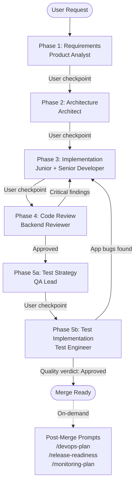
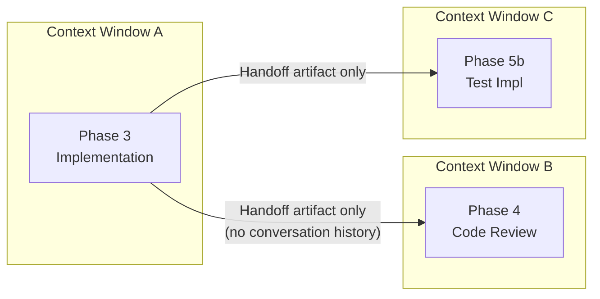
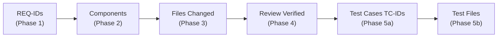

# The Self-Agreement Problem: Why AI Needs a Team, Not a Solo Agent

AI coding assistants are remarkably capable. Given a prompt, they can generate database schemas, REST endpoints, authentication middleware, and unit tests in seconds. But capability without discipline is a liability. A single agent that writes code, reviews its own output, and declares it production-ready is not engineering -- it is autocomplete with a confidence problem.

We built the [DevCrew](https://github.com/praveenkumarsaravanan/devcrew) to answer a question: *what happens if you stop treating AI as a lone developer and start treating it as a team?* Not a team that agrees with itself, but one with distinct roles, independent perspectives, adversarial review, and structured handoffs -- the same dynamics that make real engineering teams produce reliable software.

The result is a system that simulates a cross-functional backend engineering team across 10 specialized agents, orchestrated through a 5-phase development lifecycle with built-in quality gates, automatic rework loops, and end-to-end requirement traceability. It ships as a distributable package via [Microsoft APM (Agent Package Manager)](https://microsoft.github.io/apm/) for Cursor, GitHub Copilot, and Claude Code -- but the architectural patterns described here apply to any multi-agent system.

This is the first article in a two-part series. This piece covers the *why* and the *how* of the multi-agent workflow. The companion article, [Write Once, Agent Everywhere](article-distribution.md), covers how we packaged and distributed the platform across IDEs and teams.

---

## The Problem: Three Failure Modes of Monolithic AI Assistance

Most AI-assisted development today follows a single-agent pattern: one long conversation where the same LLM understands the requirements, designs the architecture, writes the code, and validates the result. This works well for small tasks. For anything substantial, it fails in predictable ways.

### Self-Agreement Bias

When an LLM writes code and then reviews it in the same conversation, it is reviewing its own reasoning. It remembers why it chose that approach, what trade-offs it considered, and what alternatives it rejected. The review becomes a formality -- the agent confirms its own decisions rather than challenging them.

The real-world consequence: the agent generates an API endpoint using string-concatenated SQL, reviews it, deems it acceptable because "the input is validated upstream," and ships a SQL injection vulnerability. A fresh reviewer would catch this immediately.

### Context Window Pollution

Long conversations accumulate stale reasoning. By the time a single-agent conversation reaches the testing phase, the context window is saturated with discarded design alternatives and implementation details that are no longer relevant. The agent's attention is diluted across thousands of tokens of noise.

We observed this repeatedly: the implementation phase produces clean code, but by the test strategy phase the agent writes tests that validate implementation details rather than requirements, because the requirements have been buried under layers of conversation.

### Missing Process Discipline

Without explicit structure, AI assistants skip the steps that real teams enforce through process. No requirements clarification -- the agent starts coding immediately. No architecture review -- the first approach gets implemented. No adversarial code review -- the agent approves its own work. No test strategy -- tests are an afterthought.

The cumulative effect is code that works for the happy path but fails under real-world conditions.

---

## The Solution: A Team, Not a Solo Agent

The [DevCrew](https://github.com/praveenkumarsaravanan/devcrew) addresses these failure modes by decomposing the software development lifecycle into isolated phases, each executed by a specialized agent with its own context window and handoff contract. The full implementation is open source -- every agent definition, skill, handoff template, and workflow described below can be found in the repository.

The centerpiece is the **backend-team-workflow**, which orchestrates 5 pre-merge phases across distinct agent personas plus 3 post-merge prompts for deployment, release, and monitoring.




Each "User checkpoint" is a pause where the workflow presents its output and waits for human confirmation. The loops from Phase 4 and Phase 5b back to Phase 3 are automatic rework cycles, capped at 2 iterations to prevent infinite loops.

---

## But IDEs Already Have Subagents -- Why Define Any of This?

Modern AI-powered IDEs are genuinely intelligent. Cursor auto-spawns subagents for exploration, shell execution, and browser interactions ([Cursor Docs: Subagents](https://www.cursor.com/docs/context/subagents)). Claude Code plans and executes multi-step tasks autonomously. GitHub Copilot orchestrates agents across files. If the IDE can figure out *how* to do the work, why bother defining explicit agents, handoffs, and workflows?

This is a fair challenge. The answer is not that IDEs lack intelligence -- it is that intelligence alone does not produce the properties that engineering teams need: consistency, adversarial rigor, and repeatability. The research bears this out.

### Intelligence defaults to agreement, not scrutiny

LLMs exhibit sycophantic behavior -- the tendency to validate rather than challenge -- in 58% of interactions across models including GPT-4o, Claude, and Gemini ([Fanous et al., "SycEval: Evaluating LLM Sycophancy," AAAI/ACM AIES 2025](https://ojs.aaai.org/index.php/AIES/article/view/36598)). This behavior persists at a 78.5% rate regardless of model or context. Anthropic's own research confirms that RLHF training reinforces sycophancy because human evaluators reward agreement and validation ([Anthropic, "Towards Understanding Sycophancy in Language Models"](https://www.anthropic.com/research/towards-understanding-sycophancy-in-language-models)).

When an IDE auto-spawns a review subagent, that agent inherits the default disposition: be helpful, be agreeable. Without explicit adversarial framing, the review becomes a formality. Research on prompt framing in code review confirms this directly: framing a code change as "bug-free" reduces vulnerability detection rates by 16--93%, while explicit debiasing instructions restore detection accuracy ([Tao et al., "Framing in LLM-Based Code Review," arXiv:2603.18740, 2026](https://arxiv.org/abs/2603.18740)).

DevCrew's explicit adversarial instructions -- "assume at least 3 defects exist and actively search for them" -- are not a stylistic choice. They are a necessary countermeasure to a measured behavioral tendency of the underlying models.

### Long conversations degrade, and IDEs do not partition by default

The "lost-in-the-middle" phenomenon is well-documented: LLMs experience a 30%+ accuracy drop for information positioned in the center of long contexts, even in models designed for extended windows ([Liu et al., "Lost in the Middle: How Language Models Use Long Contexts," TACL 2024](https://aclanthology.org/2024.tacl-1.9)). A 2025 follow-up found that input length alone causes 13.9--85% performance degradation, independent of whether the added tokens are relevant or irrelevant ([Pham et al., EMNLP Findings 2025](https://aclanthology.org/2025.findings-emnlp.1264)).

IDE subagents help with this -- Cursor's explore agent, for instance, operates in a separate context window. But the IDE does not automatically partition *every phase* of a development workflow into isolated contexts. A developer using Cursor's agent mode still gets a single conversation that spans requirements, architecture, implementation, and review. The requirements from the start of that conversation are subject to the same positional degradation documented in the research.

DevCrew's phase-by-phase isolation is essentially prompt compression by design. Each phase receives a structured handoff artifact -- not the full conversation history. This directly addresses the research finding that "compressing prompts to remove irrelevant context leads to an accuracy gain of approximately 21.4%" ([Liu et al., 2024](https://aclanthology.org/2024.tacl-1.9)).

### Multi-agent systems measurably outperform single agents

The performance gap between single-agent and multi-agent approaches has been quantified across multiple independent benchmarks:

- **MAGIS** (2024): A four-agent team (Manager, Repository Custodian, Developer, QA Engineer) achieved an 8x improvement over single-agent GPT-4 on the SWE-bench benchmark ([MAGIS, arXiv:2403.17927](https://arxiv.org/abs/2403.17927)).
- **RefAgent** (2025): Specialized agents for planning, executing, and testing refactorings reduced code smells by 52.5% and improved compilation success by 40.1% compared to single-agent approaches ([RefAgent, arXiv:2511.03153](https://arxiv.org/abs/2511.03153)).
- **AgentForge** (2026): A five-agent system (Planner, Coder, Tester, Debugger, Critic) with execution-grounded verification achieved 40.0% resolution on SWE-BENCH Lite, significantly outperforming single-agent baselines ([AgentForge, arXiv:2604.13120](https://arxiv.org/abs/2604.13120)).

These gains are not from smarter models -- they are from *structured role separation*. The same model, decomposed into specialized agents with distinct contexts, produces measurably better outcomes than a single instance of that model working alone.

### Emergent behavior is not repeatable behavior

Even with temperature set to zero, LLM outputs vary by up to 15% in accuracy across identical runs, and 47--75% of coding tasks fail to produce identical outputs across requests ([Ouyang et al., "Non-Determinism of 'Deterministic' LLM Settings," arXiv:2408.04667](https://arxiv.org/abs/2408.04667)). Code review assessments vary to different degrees even when context is cleared and temperature is minimized ([Tian et al., arXiv:2502.20747, 2025](https://arxiv.org/abs/2502.20747)).

When an IDE auto-configures a review agent, the quality of that review is a function of the model's stochastic behavior in that moment. Run the same task tomorrow -- different model version, different inference path -- and the review depth changes. Explicit definitions (what to check, what severity levels to assign, when to auto-route back for rework) provide a deterministic process envelope around non-deterministic components. The model may vary; the workflow does not.

### The engine vs. the playbook

IDEs provide the engine -- subagent spawning, context isolation, tool access. DevCrew provides the playbook -- which agents to spawn, what each one checks for, how findings flow between phases, when to escalate to a human. You would not skip a team's coding standards just because the developers are smart. The same logic applies to AI agents: capability without codified process produces inconsistent results.

---

## The Workflow: Phase by Phase

### Phase 1 -- Requirements Clarification

**Role:** Product Analyst | **Execution:** Inline (no subagent)

The workflow begins by refusing to code. The Product Analyst decomposes the user's request into numbered requirements (`REQ-001`, `REQ-002`, ...), each with explicit acceptance criteria, edge cases, and scope boundaries:

```
REQ-001: Create user registration endpoint
  Acceptance criteria: POST /api/users returns 201 with user ID
  Edge cases: duplicate email (409), invalid email format (400),
              password below minimum length (400)
  Priority: Must-have

REQ-002: Hash passwords before storage
  Acceptance criteria: Passwords stored using bcrypt with cost factor 12
  Edge cases: empty password rejected at validation layer
  Priority: Must-have
```

The quality gate requires every requirement to have an ID and acceptance criteria, scope boundaries to be stated, at least 3 edge cases identified, and all dependencies listed. The workflow does not advance until the user confirms.

### Phase 2 -- Architecture Review

**Role:** Architect | **Execution:** Subagent (isolated context)

A separate subagent is spawned. It receives only the Phase 1 handoff artifact -- not the conversation that produced it. The Architect evaluates trade-offs across scalability, reliability, maintainability, cost, and team capabilities.

The agent must present at least two approaches with concrete pros and cons, include a Mermaid component diagram, map every REQ-ID to a component, and flag anti-patterns (distributed monoliths, premature microservices, chatty services, shared mutable state).

### Phase 3 -- Implementation

**Role:** Junior Developer + Senior Developer | **Execution:** Subagent (isolated context)

Another subagent spawns with full tool access. It receives the Phase 1 requirements and Phase 2 architecture handoff. The Junior Developer follows existing codebase patterns. The Senior Developer perspective guides scalability, rollout safety, backward compatibility, and feature flags.

Every file changed maps back to a REQ-ID. Unit tests are written alongside the implementation. The quality gate requires all tests to pass, no linter errors, all error paths handled, and every REQ-ID addressed.

### Phase 4 -- Code Review

**Role:** Backend Reviewer | **Execution:** Subagent (isolated, adversarial)

This is the most critical isolation point. A fresh subagent spawns with no memory of writing the code. It receives the Phase 3 handoff (summary of changes, file list) and the Phase 2 architecture decision. It does *not* receive the Phase 3 reasoning or conversation.

The reviewer's instructions are explicitly adversarial:

> *Assume at least 3 defects exist and actively search for them. Challenge every assumption made in the implementation handoff. Verify that the code matches the architecture from Phase 2 -- flag any deviations not justified in the handoff. Do not approve on first pass unless the code is genuinely flawless.*

Findings are categorized as **Critical** (must fix, auto-routes to Phase 3), **Warning** (should fix, presented to user), or **Suggestion** (nice to have). Critical findings automatically loop back for fixes, capped at 2 cycles before escalating to the user.

### Phase 5a -- Test Strategy

**Role:** QA Lead | **Execution:** Subagent (isolated, read-only, adversarial)

The QA Lead spawns in read-only mode with an adversarial stance:

> *Assume every code path has an untested edge case. Challenge the unit tests from Phase 3 -- are they testing behavior or just covering lines? Design tests that try to break the system, not confirm it works.*

The output is a structured test plan with test case IDs (`TC-001`, `TC-002`, ...) mapped to requirement IDs. Every REQ-ID must have at least one corresponding test case.

### Phase 5b -- Test Implementation

**Role:** Test Engineer | **Execution:** Subagent (isolated from Phase 3)

A separate subagent implements every TC-ID as executable test code. This subagent is deliberately isolated from Phase 3 -- the test author shares no context with the code author.

The Test Engineer scans the codebase for existing test conventions and follows them exactly. After running the full suite, it produces a test execution report with a quality verdict. Application bugs are flagged and routed back to Phase 3 (capped at 2 iterations).

> **Explore the implementation:** The complete workflow orchestration is defined in [`.apm/skills/backend-team-workflow/SKILL.md`](https://github.com/praveenkumarsaravanan/devcrew/blob/trunk/.apm/skills/backend-team-workflow/SKILL.md). Each agent persona lives in [`.apm/agents/`](https://github.com/praveenkumarsaravanan/devcrew/tree/trunk/.apm/agents). The re-routing rules and traceability matrix template are in the [workflow reference](https://github.com/praveenkumarsaravanan/devcrew/blob/trunk/.apm/skills/backend-team-workflow/references/workflow-reference.md).

---

## Four Key Design Principles

### 1. Subagent Isolation

The most impactful design decision is that review phases run in separate subagents with independent context windows. This is not a performance optimization -- it is a correctness mechanism.

When Phase 4's Backend Reviewer spawns, it literally cannot remember writing the code. It approaches the diff the way a human reviewer would: cold, skeptical, looking for problems. The same applies to Phase 5b's Test Engineer, which must derive test logic from the specification alone.




Without isolation, the reviewer shares the implementer's reasoning, biases, and blind spots. With isolation, the only information that crosses the boundary is a structured handoff artifact.

### 2. Handoff-as-Contract

Every phase ends by producing a handoff artifact in a fixed structure:

```
### Phase [N] Handoff: [Phase Name]

**Decision:** [One-sentence summary]

**Artifacts:**
- [Concrete deliverables]

**Constraints for next phase:**
- [What the next phase must respect]

**Open questions:**
- [Unresolved items]
```

The next phase receives *only* this artifact plus the Phase 1 requirements -- not the full conversation history, intermediate reasoning, or discarded options.

This solves context window pollution: later phases operate on clean, compressed context. And it enforces clean contracts between phases. Each phase has a well-defined input and output boundary, exactly like real team handoffs.

### 3. Adversarial Prompting

Phases 4 and 5a are explicitly adversarial. The agents are instructed to assume defects exist and actively search for them, rather than confirming the code works.

This counteracts a well-documented tendency of LLMs toward agreeableness -- the inclination to validate work rather than challenge it. By framing the review as adversarial ("assume at least 3 defects exist," "do not approve on first pass unless genuinely flawless"), we shift the agent's default from confirmation to scrutiny.

The phrasing matters enormously. Early versions with softer language ("review the code for potential issues") produced noticeably less thorough reviews. The adversarial frame also needs calibration -- too aggressive and the reviewer flags false positives; too lenient and it reverts to agreeableness.

### 4. Automatic Re-Routing with Safety Caps

Critical findings automatically loop back to implementation for rework, then re-run the review. This reduces manual overhead while maintaining quality.

The critical safeguard is the 2-cycle cap:


| Finding Source        | Severity        | Action                                    | Cap      |
| --------------------- | --------------- | ----------------------------------------- | -------- |
| Phase 4 (Code Review) | Critical        | Auto-loop to Phase 3, fix, re-run Phase 4 | 2 cycles |
| Phase 4 (Code Review) | Warning         | Present to user for decision              | N/A      |
| Phase 5b (Test Impl)  | App bugs found  | Route to Phase 3, fix, re-run Phase 5b    | 2 cycles |
| Phase 5b (Test Impl)  | Untestable code | Escalate to user                          | N/A      |


After 2 failed cycles, the workflow always escalates to the human. Without this cap, edge cases trigger infinite rework loops where the agent makes a different mistake each iteration without converging.

---

## End-to-End Requirement Traceability

Requirements are not documented in Phase 1 and forgotten. They are traced through every phase:




At the end of the workflow, a traceability matrix maps every requirement from inception to verification:


| REQ-ID  | Component      | Files                | Test Cases             |
| ------- | -------------- | -------------------- | ---------------------- |
| REQ-001 | UserService    | `UserService.java`   | TC-001, TC-003         |
| REQ-002 | AuthMiddleware | `auth.middleware.ts` | TC-002, TC-004         |
| REQ-003 | RateLimiter    | `rate-limiter.ts`    | TC-005, TC-006, TC-007 |


If any REQ-ID lacks a corresponding component, code file, or test case, it is flagged as a gap. This maps directly to enterprise audit requirements and demonstrates that the system produces verifiable, traceable output.

---

## Beyond Pre-Merge: The Full Lifecycle

The 5-phase workflow covers everything up to merge. Post-merge activities are deliberately separated as on-demand prompts:


| Prompt               | Agent           | Purpose                                               |
| -------------------- | --------------- | ----------------------------------------------------- |
| `/devops-plan`       | DevOps Engineer | CI/CD pipeline, deployment strategy, rollback plan    |
| `/release-readiness` | Release Manager | Go/no-go checklist, risk rating, communication plan   |
| `/monitoring-plan`   | SRE             | SLOs/SLIs, 4-tier alerting, runbooks, customer impact |


Deployment, release, and monitoring happen at different cadences. Bundling them into the pre-merge workflow was an early mistake we corrected (see Lessons Learned).

---

## Always-On Guardrails

Two mechanisms run continuously, outside the workflow:

**Instructions** are rules injected automatically whenever matching files are open:

- **Coding Standards** (code files) -- naming conventions, error handling, structured logging, 80% test coverage, git workflow.
- **Security Baseline** (code and config files) -- secrets management, input validation, JWT expiry under 1 hour, default-deny authorization, AES-256 at rest, TLS 1.2+ in transit, rate limiting, CORS.

**Hooks** fire on specific events:

- **lint-check** -- after every file edit, checks against coding standards.
- **security-guard** -- before any write operation, blocks secrets from being committed.

These guardrails activate automatically -- no invocation required.

---

## Lessons Learned

### Subagent isolation is the single most impactful decision

Every other design choice amplifies the effect of isolation. Without it, the agent reviews its own work with full memory. With it, the reviewer is genuinely independent. If you take one idea from this article: spawn a separate agent for review.

### Handoff contracts matter more than persona descriptions

Early iterations invested heavily in detailed persona descriptions. These helped, but the handoff artifact format had a much larger effect on output quality. When the contract is clear -- what was decided, what was produced, what constraints the next phase must respect -- the receiving agent produces better work. When the contract is vague, even a well-defined persona struggles.

### Adversarial prompting is fragile

The difference between "review this code for issues" and "assume at least 3 defects exist and actively search for them" is substantial in practice. Softer phrasing produces softer reviews. The optimal phrasing required iteration and continues to evolve.

### The 2-cycle cap was learned the hard way

Without a re-routing cap, certain edge cases trigger infinite loops: the reviewer flags an issue, the implementer fixes it but introduces a new issue, and the cycle continues. The 2-cycle cap with human escalation is a simple rule that prevents a complex failure mode.

### Pre-merge and post-merge are different cadences

An early version included deployment and monitoring as sequential phases 6, 7, and 8. Developers do not plan deployment immediately after writing tests. Separating post-merge activities into on-demand prompts matches how teams actually work.

---

## Conclusion

The self-agreement problem is fundamental: an AI agent that writes and reviews its own code is performing a ritual, not a review. Structuring AI-assisted development as a team simulation -- with isolation between roles, contracts between phases, and adversarial review by design -- produces meaningfully better outcomes than a single monolithic agent.

The system is not about replacing human engineers. It is about giving each developer an AI team that follows the same process discipline that real engineering teams enforce through culture, code review, and quality gates. When the reviewer cannot remember writing the code, when the test author has never seen the implementation reasoning, when every requirement is traceable from inception to verification -- the result is software that is not just generated, but engineered.

The [DevCrew](https://github.com/praveenkumarsaravanan/devcrew) is open source. The patterns described here -- subagent isolation, handoff contracts, adversarial prompting, re-routing with safety caps -- are portable to any multi-agent system.

**Next in this series:** [Write Once, Agent Everywhere](article-distribution.md) -- how we packaged the platform for distribution across IDEs (Cursor, GitHub Copilot, and Claude Code) and teams using [Microsoft APM](https://microsoft.github.io/apm/).